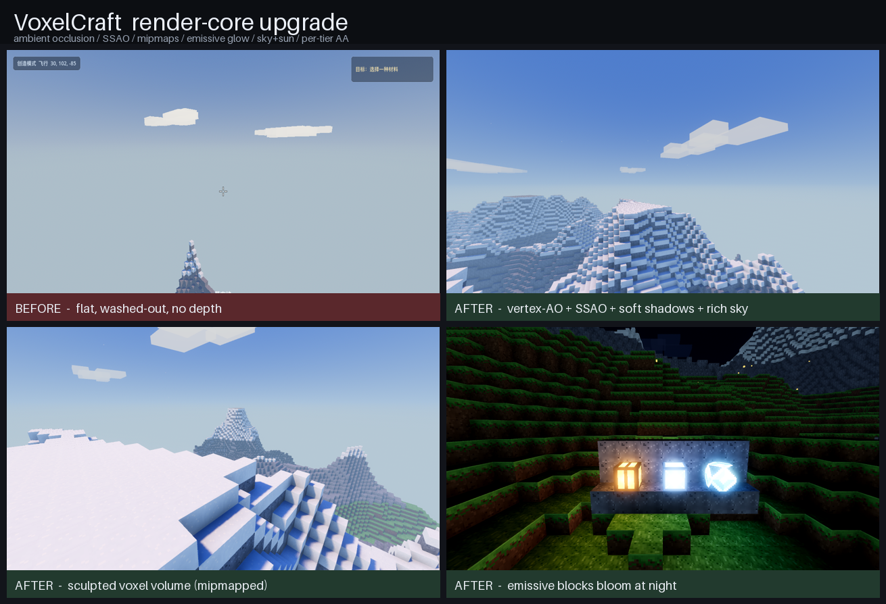

# OurWorlds

[](LICENSE)
[](https://godotengine.org)

一个宏大、可无限延伸的 **3D 体素创造沙盒**，用 **Godot 4.6 + 纯 GDScript** 从零实现，不依赖任何第三方体素库。
最大亮点：**可由你自带的本地 OpenClaw AI agent 自主游玩**——观察世界、建造、探索、修复地标。

> A grand, endless **3D voxel creative sandbox**, built from scratch in Godot 4.6 + pure GDScript —
> and playable autonomously by **your own local AI agents**.



---

## 🤖 让 AI agent 玩你的世界（项目亮点）

OurWorlds 内置一个 **agent 桥**：本地 TCP / NDJSON，仅监听 `127.0.0.1`，需显式开启。你在本机配好自己的
OpenClaw 后，agent 就能 `observe / scan / goto / build / place / break / say / set_goal / remember`——
自主在世界里建造和探索，并在游戏内 HUD 上 narrate 它正在做什么。

```bash
# 1) 准备 MCP 服务器 + 环境自检 + 拷贝示例 agent 工作区
bash agent-bridge-mcp/setup.sh

# 2) 以「可被 agent 接入」模式启动游戏（开放 127.0.0.1:8970 桥）
bash run_with_agent.sh
#    进入/新建一个世界；agent 连上后，右上角会出现「🤖 agent 已连接」角标

# 3) 把 MCP 服务器接入你的 OpenClaw（详见下方文档）
```

- 协议契约：[`docs/agent-bridge-contract.md`](docs/agent-bridge-contract.md)
- OpenClaw 接入指南：[`docs/openclaw-integration.md`](docs/openclaw-integration.md)
- 不经 MCP 的直连示例脚本：[`agent-bridge-mcp/examples/`](agent-bridge-mcp/examples/)

> **安全**：agent 桥只监听 `127.0.0.1`、单客户端、且必须设置 `OW_AGENT_PORT` 才启用——不要把该端口暴露到公网。
> 模型与凭证都在你本地的 OpenClaw 里，不经过本项目。

---

## ✨ 特性

**世界与内容**
- 程序化无限风格地形：丘陵 + 山脊高山 + 海平面湖水 + 沙岸
- **二维群系**（温度 × 湿度）：草原 / 针叶林 / 苔原 / 沙漠 / 花海草甸 / 红土台地 / 雪峰 / 岩岭 / 湿地 / 水岸
- **地下溶洞奇观**：大空腔水晶洞（蓝晶 + 苔石）、矿脉房间、暖光石照明的地下祭坛
- 30+ 种方块：地形 / 建材 / 自然 / 装饰 / 矿物，含精炼金属、红沙/赤陶、可建造光源（灯笼/月石灯/暖光石）
- 探索循环：遗迹发现与修复、矿物图鉴、旅行手记、世界地图、成就

**渲染（精致观感）**
- **逐顶点环境光遮蔽（AO）** + **屏幕空间 AO（SSAO）** + 柔和软阴影 → 方块有真实体积感
- **Mipmap** 贴图 → 消除远处闪烁/摩尔纹
- **自发光材质 + 泛光**：灯笼/月石灯/蓝晶/暖光石夜间真正发光
- 程序生成像素图集（最近邻采样保持像素硬边）+ 菲涅尔水面着色器
- 动态天空/太阳/月亮/星空、昼夜循环、动态雨雪天气、体积感云
- 三档画质（性能/均衡/精美：MSAA/TAA 可选）

**交互与表现**
- 第一人称：移动、跳、创造飞行、挖/放、准星活化反馈
- **建造画笔 + 模板库**：平台/立柱/拱门/墙/楼梯/房架/小屋/营火/小桥/花圃/灯塔，一键起形、可旋转、整组撤销
- **材料库**：分类 + 语义搜索（拼音/英文别名）+ 2.5D 等距缩略图 + 最近使用
- GPU 粒子碎片反馈、程序化音效（复音、方位感）、天气环境声床
- 新手引导、紧凑导航罗盘、拍照模式
- 统一 UI 主题、暂停菜单（视距/画质/音量/灵敏度/天气/全屏/分辨率）、标题世界选择与封面预览

**性能与健壮性**
- **可见面合并网格**（隐藏面剔除）+ 多线程后台造网格（WorkerThreadPool）
- 批量编辑：一次大模板放置从 ~8500ms 主线程冻结降到 **~1ms**（数据同步写 + 后台单次重建）
- 线程安全收尾、存档临时文件写入 + `.bak` 备份回退

## 🎮 操作

| 操作 | 键 | 操作 | 键 |
|---|---|---|---|
| 移动 | W A S D | 挖 / 放方块 | 鼠标左键 / 右键 |
| 视角 | 鼠标 | 选方块 | 数字键 1–8 / 滚轮 |
| 跳 / 跑 | 空格 / Shift | 材料库 / 最近材料 | E / R |
| 飞行切换 | 双击空格（空格升·Shift降） | 建造画笔 | B |
| 暂停 / 抓放鼠标 | Esc | 模板 上/下 · 旋转 | Q / T · G |
| 切换视角 | V 或 F5 | 撤销 / 重做 | Z / Y |
| 旅行手记 / 世界地图 | J / M | 拍照模式 / 截图 | F1 / F2 |

## 🚀 运行

```bash
# 编辑器：用 Godot 4.6 打开本工程，按 F5
godot --path .
```

## ✅ 自检

```bash
# 全部 headless 逻辑自检（CI 也跑这个）
bash tests/run_all.sh
# 截图（需渲染，别加 --headless）
godot --path . --script res://tests/shot_quality.gd     # 近景/远景观感
godot --path . --script res://tests/shot_emissive.gd    # 夜间发光
godot --path . --script res://tests/shot_biomes.gd      # 群系俯瞰
```

## 📦 打包发布

macOS（universal：Apple Silicon 原生 + Intel）一条命令导出 + 签名（用**你自己的** Developer ID）：

```bash
SIGN_IDENTITY="Developer ID Application: Your Name (TEAMID)" bash packaging/build_macos.sh
```

拿到 Apple 公证凭证后可一键补公证（`NOTARY_PROFILE=… bash packaging/build_macos.sh`）。
完整流程与 Windows/Linux 说明见 [`packaging/README.md`](packaging/README.md)。

## 🧩 架构（每个模块职责单一、可单独测）

| 模块 | 文件 | 职责 |
|---|---|---|
| BlockLibrary | `scripts/BlockLibrary.gd` | 方块数据表 + 程序像素图集 + 材质（哑光/自发光分桶）+ 后台线程 LUT |
| Chunk / ChunkMesher | `scripts/Chunk.gd` · `ChunkMesher.gd` | 区块数据（16×16×96）→ 网格 + 碰撞，隐藏面剔除 + 逐顶点 AO |
| WorldGenerator | `scripts/WorldGenerator.gd` | 噪声地形 + 二维群系 + 溶洞 + 结构，线程安全 + 预设 |
| World | `scripts/World.gd` | 区块流式加载/卸载、批量编辑、存档、后台造网格调度 |
| Player / HUD | `scripts/Player.gd` · `HUD.gd` | 第一人称控制 / 准星 + 快捷栏 + 引导 + 状态栏 + agent 角标 |
| AgentBridge | `scripts/AgentBridge.gd` | 本地 TCP/NDJSON 桥，把 12 个工具映射到游戏方法，供 LLM agent 调用 |
| Main | `scripts/Main.gd` | 启动编排：环境/天空/太阳/昼夜 + 接好各系统 + agent 桥 |

更多设计见 [`docs/DESIGN.md`](docs/DESIGN.md)。

## 📌 状态

- ✅ 宏大可玩切片 + 渲染地基/性能 + 内容/UX 打磨（详见 [`docs/DESIGN.md`](docs/DESIGN.md)）
- ✅ AI agent 桥（TCP/NDJSON）+ MCP 服务器 + OpenClaw 接入 + 游戏内连接角标
- ✅ macOS 打包发布管道（universal 导出 + Developer ID 签名 + 硬化运行时；公证待自备 Apple 凭证）
- 🧪 全套 headless 逻辑自检：**43/43 通过**
- ⏭ 路线（欢迎贡献）：在线多人、数据驱动 Mod/材质包、生存玩法、Windows/Linux 签名、i18n

## 📄 许可

**MIT** —— 见 [LICENSE](LICENSE)。贡献流程见 [CONTRIBUTING.md](CONTRIBUTING.md)。

## ⚖️ 声明 / Disclaimer

OurWorlds 是一个独立的开源研究项目，**与 Mojang、Microsoft 或 Minecraft 无任何关联，未获其授权或背书**。
所有名称与商标归各自所有者所有。

> OurWorlds is an independent, open-source research project and is **not affiliated with, authorized, or
> endorsed by Mojang, Microsoft, or Minecraft**. All trademarks are the property of their respective owners.
